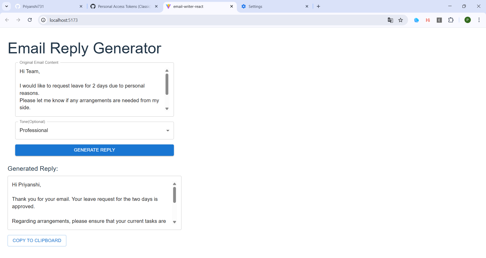
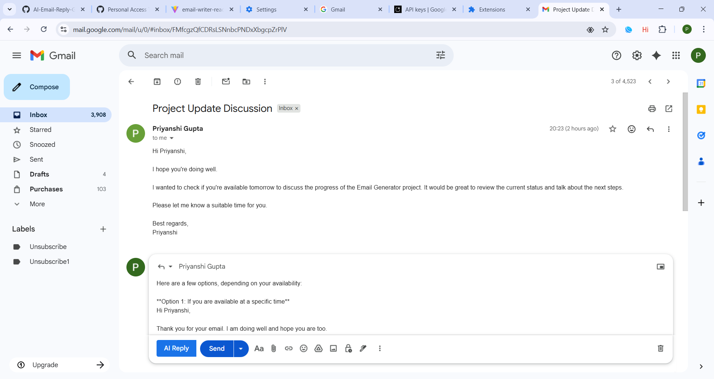

# ✉️ AI Email Reply Generator

An AI-powered Gmail Email Reply Generator built using **Spring Boot**, **React (Material UI)**, **Chrome Extension**, and **Google Gemini API**.

This project automatically generates professional email replies directly inside Gmail using AI.

---

## 🚀 Features

* Generate AI email replies instantly
* Works directly inside Gmail compose box
* Uses Google Gemini API for intelligent responses
* Custom tone support (Professional, Friendly, etc.)
* Full-stack architecture

---

## 🧠 Tech Stack

### Backend

* Spring Boot
* WebClient
* REST API
* Gemini AI API

### Frontend

* React (Vite)
* Material UI

### Browser Integration

* Chrome Extension
* Gmail DOM Injection

### API Testing

* Postman

---

## ⚙️ Project Architecture

Gmail → Chrome Extension → React UI → Spring Boot API → Gemini AI → Reply Generated

---

## 📸 Screenshots

### Frontend UI


### Backend (MongoDB)



## 📂 Folder Structure

```
email-writer/
│
├── email-writer-sb/        # Spring Boot Backend
├── email-writer-react/     # React Frontend (Material UI)
├── chrome-extension/       # Gmail AI Reply Chrome Extension
└── README.md
```

---

## 🔌 API Endpoint

POST http://localhost:8080/api/email/generate

### Request Body

```json
{
  "emailContent": "Meeting is postponed",
  "tone": "professional"
}
```

---

## 🧪 Tested Using

* Postman
* Chrome Extension
* Gmail UI

---

## 🛠 Setup Instructions

### Backend

```
cd email-writer-sb
mvn spring-boot:run
```

### Frontend

```
cd email-writer-react
npm install
npm run dev
```

---

## 🧩 Chrome Extension Setup

1. Open Chrome → Extensions
2. Enable Developer Mode
3. Click Load Unpacked
4. Select chrome-extension folder

---

## 🤖 AI Model Used

Google Gemini API

---

## 👩‍💻 Author

Priyanshi Kumari
MCA Student | Full Stack Developer
